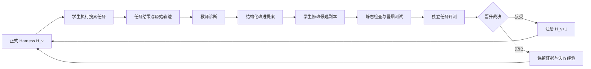

# Coding Agent 自进化系统设计

本文档集给出一个可工程落地的 Coding Agent harness 自进化项目方案。系统通过真实任务执行产生证据，由教师 Agent 诊断失败，由学生 Agent 在隔离工作区修改下一版 harness，再由独立评测器决定候选是否晋升。

系统优化的是 Agent 的工作机制，而不是某一道任务的答案：

$$
A_v = M_{student} + H_v
$$

其中学生模型 `M_student` 在同一实验中保持固定，`H_v` 是可演化的 harness 版本。只有当 `H_candidate` 在相同模型、任务、预算和环境下通过独立验收，它才可以替换当前版本。

## 核心闭环



## 设计结论

- 任务执行期冻结 harness；候选在新进程、新会话和独立工作区中产生。
- 教师负责诊断、证据引用和实验建议，不提交任务补丁，也不直接写 harness 补丁。
- 学生有“任务执行”和“harness 改造”两种模式；两种模式不共享会话状态。
- 控制层、评测器、隐藏测试、预算核算、权限策略和版本晋升逻辑不可被候选修改。
- 原始轨迹是事实源；摘要、标签和教师结论都是可重建的派生数据。
- MVP 使用单 champion、单 challenger。候选池、Pareto 前沿和跨版本组件组合在闭环稳定后启用。
- 主要能力指标来自外部测试；轨迹评价用于诊断和约束，不能代替任务正确性。
- 搜索集、晋升集和最终测试集分离，避免把持续参与选择的数据误当成未见测试。

## 章节导航

| 章节 | 模块 | 主要产出 |
|---|---|---|
| [01](01-目标与边界.md) | 目标与边界 | 优化对象、角色权限、成功标准 |
| [02](02-总体架构.md) | 总体架构 | 控制面、执行面、证据面与端到端数据流 |
| [03](03-Harness契约与搜索空间.md) | Harness 契约 | 可演化接口、受保护边界、候选清单 |
| [04](04-任务执行运行时.md) | 任务运行时 | 沙箱、会话、预算、终止和任务产物 |
| [05](05-轨迹与可观测性.md) | 轨迹系统 | 事件模型、原始证据、索引与脱敏 |
| [06](06-教师诊断模块.md) | 教师 Agent | 证据驱动诊断、输出协议和质量门禁 |
| [07](07-学生改造模块.md) | 学生 Agent | 候选生成、补丁约束、自检与变更说明 |
| [08](08-评测与晋升.md) | 评测器 | 数据划分、指标、复测与晋升规则 |
| [09](09-候选池与调度.md) | 搜索调度 | champion/challenger、Pareto 与探索利用 |
| [10](10-经验记忆.md) | 经验系统 | 事实、假设、实验结论和检索策略 |
| [11](11-编排状态机.md) | 控制器 | 状态机、失败恢复、幂等和伪代码 |
| [12](12-存储模型与接口.md) | 数据与接口 | 目录布局、实体表、端口协议和配置 |
| [13](13-安全隔离与治理.md) | 安全治理 | 权限、污染防护、防作弊和审计 |
| [14](14-部署运维与成本.md) | 运行保障 | 本地/集群部署、监控、容量和成本 |
| [15](15-实施路线与验收.md) | 项目实施 | 分阶段计划、里程碑、测试和验收清单 |
| [16](16-示例配置与数据协议.md) | 附录 | YAML、JSON Schema 风格示例和一次完整运行 |

## 推荐实现形态

MVP 推荐使用 Python 3.12：

```text
CLI/Controller        Typer + asyncio
数据模型              Pydantic
元数据                SQLite，稳定后迁移 PostgreSQL
大对象与原始轨迹      本地内容寻址目录，稳定后接 S3 兼容存储
版本管理              Git commit + worktree
任务隔离              Docker，生产环境可替换为更强沙箱
指标                   OpenTelemetry + Prometheus 兼容导出
```

实现时依赖抽象接口而不是绑定某个模型供应商、benchmark 或容器平台。最小闭环可以完全在单机运行。

## 建议阅读顺序

准备实现 MVP 时依次阅读 01、02、03、04、05、06、07、08、11、12、15。第 09 和第 10 章是闭环稳定后的搜索能力扩展；第 13 和第 14 章应在运行非可信仓库或扩大并发前落实。
