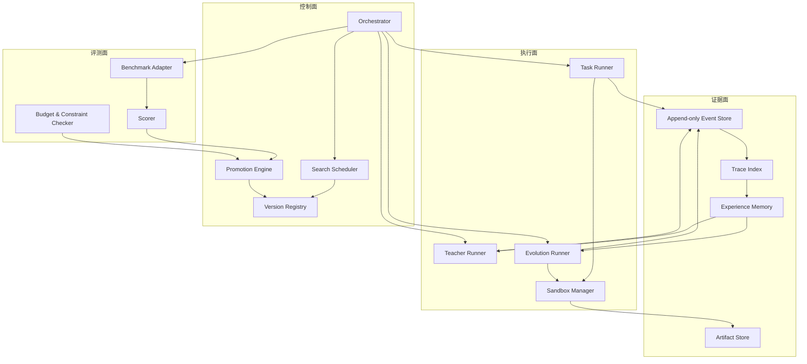
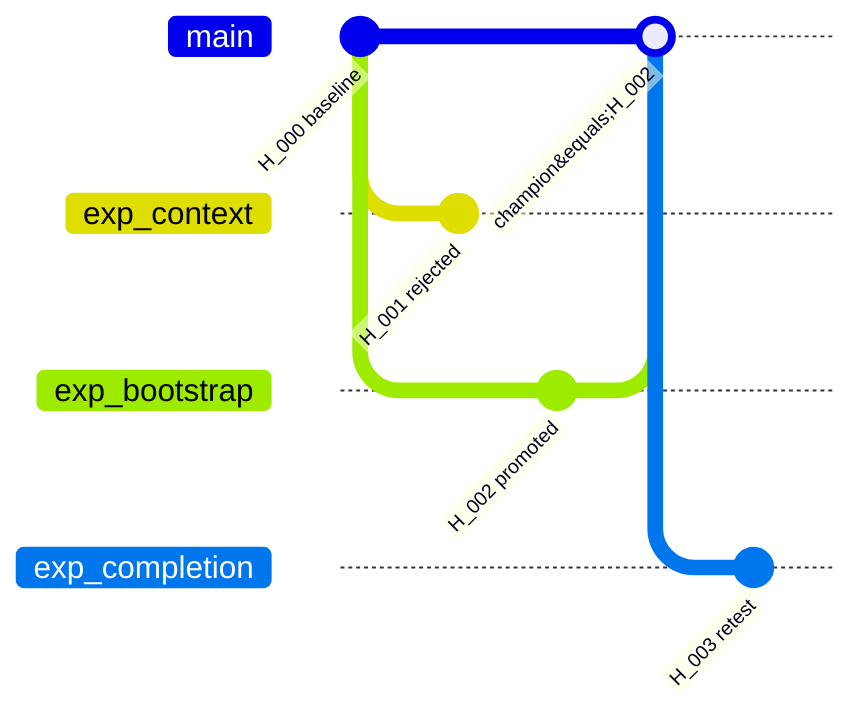

# 02 总体架构

## 2.1 分层

系统分为控制面、执行面、证据面和评测面。



### 控制面

负责状态推进和不可变事实的关联。它只执行显式规则，不让模型通过文字输出任意跳转状态。

### 执行面

负责启动学生、教师和改造会话。每个会话使用明确的输入清单、权限配置和输出协议。

### 证据面

保存原始事件、文件产物、索引和实验结论。原始数据与派生数据分开存储。

### 评测面

把任务补丁应用到干净仓库，运行公开及隐藏验收，计算能力、成本和违规指标。

## 2.2 核心组件

| 组件 | 职责 | 输入 | 输出 |
|---|---|---|---|
| `Orchestrator` | 驱动一轮进化、恢复中断流程 | experiment config、当前 champion | 状态变更、任务队列 |
| `SearchScheduler` | 选父版本、任务和实验假设 | 历史结果、预算 | iteration plan |
| `TaskRunner` | 使用指定 harness 执行任务 | harness、task、run policy | task patch、trace、usage |
| `TeacherRunner` | 生成有证据的诊断 | 代码、指标、选定轨迹 | diagnosis proposal |
| `EvolutionRunner` | 调用学生修改 harness | base worktree、proposal | candidate commit、change report |
| `SandboxManager` | 创建、限制、销毁执行环境 | image、mounts、limits | sandbox handle、runtime facts |
| `BenchmarkAdapter` | 准备任务和调用官方评测 | task snapshot、task patch | normalized evaluation result |
| `PromotionEngine` | 按固定规则比较候选 | scorecards、constraints | accept/reject/retest |
| `VersionRegistry` | 保存版本 DAG 和正式指针 | commit、manifest、decision | immutable version record |
| `TraceIndex` | 支持按版本、任务和事件查询 | raw events | searchable index |
| `ExperienceMemory` | 管理假设及其验证状态 | proposals、experiments | relevant evidence bundle |

## 2.3 端到端数据流

一次迭代采用以下顺序：

1. 控制器冻结 `iteration_plan`，记录模型、任务、预算、随机种子、镜像和基准版本。
2. `TaskRunner` 为 champion 执行搜索任务；已有且配置完全一致的有效结果可以复用。
3. 轨迹写入只追加事件流，任务补丁、日志和上下文快照写入产物库。
4. 控制器生成事实摘要，例如失败分布、回归任务、截断次数和超时次数。
5. 教师按需读取选定的原始事件和代码，输出 `DiagnosisProposal`。
6. 质量门禁验证证据引用存在、目标在白名单、建议可被验证。
7. 控制器从父版本 commit 创建候选 worktree，学生在改造模式中产生补丁。
8. 候选先经过受保护路径检查、契约测试和小规模冒烟任务。
9. 通过后在晋升集上进行配对评测；必要时对边界结果复测。
10. `PromotionEngine` 生成不可变裁决。接受时原子更新 champion 指针；拒绝时保留候选与证据。

## 2.4 版本关系

版本使用 DAG 而不是覆盖式目录：



每个版本记录：

- 父版本和 Git commit；
- 生成它的诊断提案；
- harness manifest 和代码哈希；
- 静态检查、冒烟和正式评测结果；
- 晋升裁决及规则版本；
- 可选的逻辑组件来源，用于后续组合实验。

## 2.5 角色隔离

学生的两种模式必须由两个独立会话承载：

```text
任务模式：M_student + H_v + task workspace
改造模式：M_student + H_edit + candidate harness worktree
```

`H_edit` 在一个完整实验周期内保持固定。这样可以把测量到的变化归因于任务 harness，而不是改造者能力同时发生变化。

教师会话只获得证据读取能力，不挂载可写代码目录。即使模型输出补丁文本，控制器也不应用它；只有改造模式学生产生的结构化变更可进入候选工作区。

## 2.6 可替换端口

平台核心只依赖以下抽象：

```python
class ModelGateway(Protocol): ...
class HarnessRuntime(Protocol): ...
class SandboxBackend(Protocol): ...
class BenchmarkAdapter(Protocol): ...
class ArtifactStore(Protocol): ...
class MetadataStore(Protocol): ...
class PromotionPolicy(Protocol): ...
```

模型供应商、Docker/Kubernetes、SWE-bench/自有任务集都通过 adapter 接入。业务实体不得直接依赖某个 SDK 的响应对象。

## 2.7 MVP 部署拓扑

单机版包含一个控制器进程、一个 SQLite 数据库、一个本地产物目录和若干短生命周期容器：

```text
controller
├── metadata.db
├── artifacts/sha256/...
├── repos/harness.git
├── worktrees/candidate-...
└── sandboxes/<trial-id>/
```

控制器通过本地队列限制并发。生产扩展时再拆为 API 服务、队列 worker、PostgreSQL 和对象存储，状态与协议无需改变。
