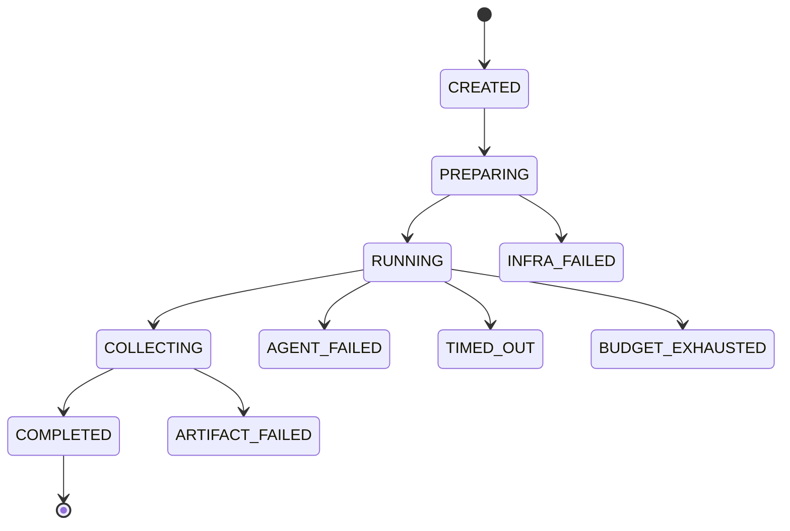

# 04 任务执行运行时

## 4.1 职责

任务执行运行时把固定的学生模型、指定 harness 和干净任务环境组合成一个 trial。它负责执行与记录，不负责判断候选是否优秀。

## 4.2 Trial 输入

```python
class TrialSpec(BaseModel):
    trial_id: str
    experiment_id: str
    harness_version_id: str
    task_snapshot_id: str
    model_config_id: str
    sandbox_image_digest: str
    budget: BudgetSpec
    seed: int | None
    attempt: int
```

`TrialSpec` 创建后不可修改。任何模型、镜像、任务或预算变化都必须生成新的 trial。

## 4.3 生命周期



基础设施失败与 Agent 失败必须分开。容器拉取失败、网络抖动和磁盘故障不应直接计为候选能力失败；语法错误、无有效补丁和在预算内未完成属于 Agent 结果。

## 4.4 干净环境

每个 trial：

- 从任务定义指定的 commit 或快照创建新工作区；
- 使用固定摘要的容器镜像；
- 使用独立临时目录、进程空间和网络策略；
- 不挂载其他 trial 的工作目录；
- 默认禁用跨 trial 模型会话、任务答案缓存和 shell 历史；
- 将只读任务说明与可写目标仓库分别挂载。

允许复用依赖层和容器镜像层，但不能复用含任务产物的可写层。

## 4.5 预算模型

预算由运行时统一计算：

```yaml
budget:
  wall_time_seconds: 1800
  model_calls: 80
  input_tokens: 500000
  output_tokens: 120000
  tool_calls: 200
  tool_output_bytes_raw: 50000000
  context_window_tokens: 128000
  cpu_seconds: 2400
  memory_mb: 8192
```

候选可以在预算内选择如何分配调用，但不能提高上限。总 token 消耗要统计所有调用，而不是只记录最后一次上下文长度。

## 4.6 工具执行

工具层采用统一 envelope：

```json
{
  "tool_call_id": "tc_01J...",
  "name": "exec_command",
  "arguments": {"cmd": "pytest -q"},
  "policy_decision": "allow",
  "started_at": "...",
  "finished_at": "...",
  "exit_code": 1,
  "stdout_artifact": "sha256:...",
  "stderr_artifact": "sha256:...",
  "raw_bytes": 248931,
  "rendered_bytes": 30210
}
```

执行器先做权限决策，再运行命令，最后将原始返回交给 harness 的 observation 策略。原始输出和展示给模型的内容分别保存。

## 4.7 上下文装配

每次模型调用记录四个层次：

1. 可用事实：runtime 可以读取的原始事件和文件。
2. harness 选择结果：被选中的事件 ID 和压缩结果。
3. 最终消息：实际发送给模型的消息序列。
4. 供应商计量：输入、缓存、输出 token 和延迟。

这样才能判断失败来自模型能力、信息未选择、压缩丢失还是工具输出转换。

## 4.8 完成协议

学生不能通过输出一句“完成”直接结束。建议使用两阶段协议：

```text
学生请求 finalize
→ runtime 冻结当前任务补丁
→ 执行候选定义的公开完成清单
→ runtime 执行固定的产物完整性检查
→ 生成 trial outcome
```

候选可以建议运行哪些公开检查，但外部 benchmark 评分只在 trial 结束后由评测面执行。

## 4.9 任务产物

每个结束状态都要产生 `TrialOutcome`：

```json
{
  "trial_id": "trial_01J...",
  "status": "COMPLETED",
  "task_patch_artifact": "sha256:...",
  "workspace_tree_hash": "sha256:...",
  "termination_reason": "agent_finalize",
  "usage": {"input_tokens": 182340, "output_tokens": 23910, "tool_calls": 57},
  "violations": [],
  "last_event_seq": 418
}
```

即使没有有效补丁，也要保存 outcome、最后状态和失败证据。

## 4.10 运行时降级

- bootstrap 命令失败：记录失败并继续使用最小初始上下文。
- 轨迹派生索引失败：原始事件成功落盘后 trial 可以继续，后台重建索引。
- 模型临时错误：按统一退避策略重试并计入可见指标。
- 事件源写入失败：立即暂停 trial，不能在无审计记录的情况下继续。
- 预算计算异常：按保守策略终止，不允许候选绕过核算。

## 4.11 并发和可复现性

MVP 可以串行运行。并发时以 `task_id + harness_version + model_config + attempt` 作为逻辑唯一键，避免重复提交。模型本身可能非确定，因此“可复现”表示输入配置、外部环境和完整观察可复查，而不是保证逐 token 相同。
