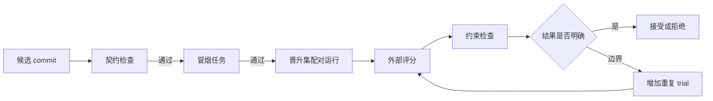

# 08 评测与晋升

## 8.1 原则

评测模块回答“候选实际上是否更好”。它独立于教师和改造学生，使用固定任务快照、外部测试和版本化裁决规则。

## 8.2 数据划分

| 集合 | 用途 | 反馈范围 |
|---|---|---|
| 搜索集 | 发现失败、教师诊断、快速迭代 | 可提供详细轨迹和任务级结果 |
| 冒烟集 | 淘汰明显不可用候选 | 提供公开错误和聚合结果 |
| 晋升集 | champion 与 challenger 的正式比较 | 只向控制器提供完整结果，教师获得受控摘要 |
| 最终测试集 | 搜索停止后的泛化报告 | 选择规则冻结前不反馈 |

划分以仓库、任务模板和问题族为单位，避免高度相似任务跨集合泄漏。

## 8.3 评测流水线



旧版本结果只有在所有输入条件完全相同且未过期时才可复用。否则 champion 与 challenger 都重跑。

## 8.4 指标

### 主要能力指标

- 完整通过任务数或加权成功率；
- 按任务族分层的成功率；
- 原本成功任务的回归数；
- 严重任务失败数。

### 成本与效率

- 总输入/输出 token；
- 模型调用与工具调用数；
- 端到端时延和 CPU 时间；
- 单个成功任务的平均成本；
- 超时和预算耗尽比例。

### 约束

- 权限违规；
- 隐藏数据访问尝试；
- 预算越界；
- 无法审计的事件缺口；
- benchmark 特化和硬编码命中。

过程指标用于解释提升，例如重复测试下降，但不能单独证明任务能力提升。

## 8.5 Scorecard

```json
{
  "evaluation_id": "eval_01J...",
  "harness_version": "H_004",
  "dataset_snapshot": "promotion-2026-09-v1",
  "trials": 80,
  "primary": {
    "passed": 51,
    "total": 60,
    "weighted_success": 0.842
  },
  "regressions": {
    "count": 1,
    "critical": 0
  },
  "cost": {
    "input_tokens": 9200000,
    "output_tokens": 680000,
    "wall_time_seconds": 38120
  },
  "constraints": {
    "violations": 0,
    "missing_event_ranges": 0
  },
  "rule_version": "promotion-v1"
}
```

## 8.6 MVP 晋升规则

第一版采用可解释的门槛规则：

```text
硬门槛：
1. 所有契约、权限和审计检查通过；
2. 无关键任务回归；
3. 总成本不超过 champion 的 110%；

能力门槛：
4. 配对任务净改善数 >= 2；
5. 总成功率不低于 champion；
6. 至少一个提案目标任务得到改善，或主要过程假设获得支持；

边界处理：
7. 净改善为 0 或 1、结果方差大、或成本接近上限时，增加重复 trial；
8. 复测仍无明确优势则保持 champion，候选记为“有趣但未晋升”。
```

实际阈值由任务数和成本调整，并作为版本化配置固定。不能在看到候选结果后临时修改门槛。

## 8.7 配对比较

同一任务上的 champion 和 challenger 形成配对：

```text
win:       challenger 通过，champion 失败
loss:      challenger 失败，champion 通过
tie-pass:  两者都通过
tie-fail:  两者都失败
```

配对结果比只看两个总成功率更容易发现净改善和具体回归。模型有随机性时，为关键任务安排多次 trial，并报告估计区间或 bootstrap 区间。

## 8.8 多目标比较

当任务能力与成本存在真实取舍时，维护向量：

\[
s(H) = (success, -tokens, -latency, -violations)
\]

硬约束先过滤。MVP 仍需选一个正式 champion，可使用产品定义的效用函数或分层规则。V2 才维护完整 Pareto 前沿，详见第 09 章。

## 8.9 防止评测污染

- 教师只读取搜索集详细轨迹；
- 晋升集可反馈聚合类别，不返回隐藏测试正文；
- 最终测试只运行冻结版本；
- 每次评测绑定任务内容哈希和评测镜像哈希；
- 任务运行与评分使用两个隔离环境；
- 评分器不执行候选提供的任意控制脚本；
- 结果缓存键包含候选 commit、任务快照、模型配置、镜像、预算和 attempt。

## 8.10 裁决记录

每次裁决保存：

```json
{
  "decision": "PROMOTE",
  "candidate": "H_004",
  "champion_before": "H_003",
  "evaluation_ids": ["eval_a", "eval_b"],
  "rule_version": "promotion-v1",
  "reason_codes": ["NET_WINS_THRESHOLD", "NO_CRITICAL_REGRESSION"],
  "decided_at": "..."
}
```

自然语言说明只用于展示，`reason_codes` 和输入 scorecard 才是可重放的裁决依据。
