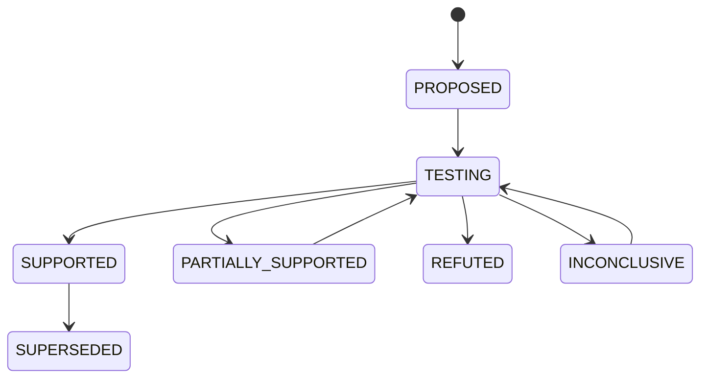

# 10 经验记忆

## 10.1 目标

经验记忆让后续迭代利用历史证据，同时避免把教师写过的解释永久当成事实。它不是简单的向量库，而是事实、假设、实验和结论的版本化关系。

## 10.2 四层模型

| 层 | 内容 | 是否可改写 |
|---|---|---|
| 事实 | 原始事件、代码、分数、环境和任务快照 | 只追加 |
| 观察 | 程序统计或教师对事实的描述 | 可新增、更正 |
| 假设 | 对失败原因和改进机制的可证伪解释 | 状态可变化 |
| 结论 | 实验对假设的支持、反驳或不确定结果 | 新实验可更新 |

## 10.3 经验条目

```json
{
  "experience_id": "exp_01J...",
  "scope": {
    "runtime_api": "1.x",
    "task_tags": ["python", "long-output"],
    "harness_modules": ["observation.render"]
  },
  "observation": "编译器错误常位于超长输出尾部",
  "evidence_refs": ["trace://...", "metric://..."],
  "hypothesis": "头尾保留会减少无效重试",
  "experiments": ["eval_01J..."],
  "status": "partially_supported",
  "counterexamples": ["trial://..."],
  "source_versions": ["H_003", "H_004"],
  "valid_from": "...",
  "supersedes": null
}
```

## 10.4 假设状态机



“候选晋升”与“假设得到支持”不是同一件事。候选可能整体提升，但无法证明教师给出的原因；也可能某个过程指标按预期改变，却没有带来任务成功率提升。

## 10.5 写入策略

以下事件触发经验写入：

- 教师提案通过质量门禁；
- 候选完成正式评测；
- 消融实验完成；
- 发现跨三个以上 trial 的重复失败模式；
- 某条历史结论在新 runtime 或任务分布上失效。

模型生成的文本先作为 `candidate_observation`，控制器绑定证据并校验后再注册。

## 10.6 检索策略

教师或学生提出查询时先结构化过滤，再做语义排序：

```text
1. runtime API 和 harness 模块兼容
2. 任务标签、语言、工具和失败类型匹配
3. 结论状态优先级：supported > partial > inconclusive
4. 时间与版本距离
5. 语义相似度
6. 保留至少一个反例或失败候选
```

返回包同时包含支持证据和反例，避免只检索成功故事。

## 10.7 上下文打包

经验包应小而可展开：

```json
{
  "query": "observation.render 中的长输出问题",
  "items": [
    {
      "summary": "头尾保留在 H_004 上改善 2 个任务，无关键回归",
      "status": "partially_supported",
      "evidence_refs": ["metric://..."],
      "counterexample_refs": ["trace://..."]
    }
  ],
  "next_page": null
}
```

Agent 可按引用读取原始证据。摘要不能成为唯一入口。

## 10.8 避免经验污染

- 所有记忆绑定来源版本和评测口径；
- 任务特定信息不得提升为全局经验；
- 隐藏测试内容不进入可供教师和学生读取的记忆；
- runtime API 或工具行为变化时，旧经验标记为需重新验证；
- 相互矛盾的结论并存，依赖证据权重与适用范围，不覆盖删除；
- 提示注入文本保留为引用数据，不直接拼接进系统指令区。

## 10.9 MVP 实现

第一版不需要向量数据库。使用以下表和全文索引即可：

```text
experiences
experience_evidence
experience_experiments
experience_tags
FTS(summary, observation, hypothesis)
```

当历史达到数千候选、跨多个 benchmark 时，再增加 embedding 索引。事实引用和结构过滤仍由关系数据维护。

## 10.10 质量指标

- 被后续提案引用的经验比例；
- 引用经验后产生重复失败候选的下降幅度；
- 检索结果中的无效版本或错误适用范围比例；
- 支持证据和反例覆盖率；
- 经验摘要可由事实源重建的比例；
- 历史结论在新任务分布上复验通过的比例。
