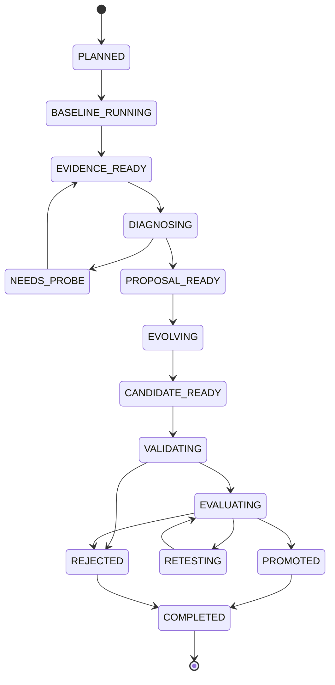

# 11 编排状态机

## 11.1 控制器职责

控制器是自进化闭环的唯一状态推进者。它把模型输出当作数据，只有通过 schema、权限和状态前置条件校验后才执行下一步。

## 11.2 迭代状态机



状态转换保存在事务中，并带 `expected_state` 乐观锁。重复 worker 只能有一个成功推进。

## 11.3 一轮伪代码

```python
async def evolve_once(experiment_id: str) -> IterationResult:
    exp = store.load_experiment(experiment_id)
    plan = scheduler.freeze_plan(exp)

    baseline = await ensure_search_results(
        version=plan.parent_version,
        tasks=plan.search_tasks,
        config=plan.eval_config,
    )
    evidence = evidence_builder.build(plan, baseline)

    proposal = await teacher.diagnose(evidence)
    proposal_gate.validate(proposal, plan)

    if proposal.outcome == "needs_probe":
        await run_probes(proposal.probes)
        return await resume_iteration(plan.iteration_id)

    candidate = await evolution_runner.create_candidate(
        parent=plan.parent_version,
        proposal=proposal,
        edit_harness=plan.edit_harness_version,
    )

    validation = await candidate_validator.run(candidate)
    if not validation.passed:
        return reject(candidate, "VALIDATION_FAILED", validation)

    smoke = await evaluator.run(candidate, plan.smoke_tasks)
    if not smoke.passed_gate:
        return reject(candidate, "SMOKE_FAILED", smoke)

    paired = await evaluator.compare(
        champion=plan.champion,
        challenger=candidate,
        tasks=plan.promotion_tasks,
    )
    decision = promotion_policy.decide(paired, plan.rule_version)

    if decision.needs_retest:
        paired = await evaluator.add_repeats(paired, decision.retest_plan)
        decision = promotion_policy.decide(paired, plan.rule_version)

    return registry.commit_decision(candidate, decision)
```

`ensure_*` 操作必须幂等。它们先按唯一键查询完整结果，再创建新任务。

## 11.4 命令模型

控制面内部使用显式命令：

```text
CreateExperiment
FreezeIterationPlan
RunTaskTrial
BuildEvidenceBundle
RequestDiagnosis
RegisterProposal
CreateCandidate
ValidateCandidate
EvaluateCandidate
DecidePromotion
PromoteCandidate
CloseIteration
```

命令包含 `command_id` 和幂等键。事件记录结果，失败时保存可重试类别。

## 11.5 幂等键

| 操作 | 幂等键 |
|---|---|
| task trial | task snapshot + harness commit + model config + budget + attempt |
| 教师诊断 | evidence bundle hash + teacher config + prompt version |
| 候选生成 | parent commit + proposal hash + edit config + attempt |
| 正式评测 | candidate commit + dataset snapshot + eval config + attempt |
| 晋升裁决 | champion + candidate + scorecard hashes + rule version |

重复请求返回已有成功结果。失败重试保留新的 attempt 和对原请求的引用。

## 11.6 失败分类

```text
TRANSIENT_INFRA      可自动重试：模型限流、容器节点短暂失败
PERMANENT_CONFIG     需停止：schema 不兼容、镜像不存在
AGENT_OUTPUT_INVALID 有界修复：教师/学生输出不符合协议
CANDIDATE_INVALID    拒绝：违规修改、契约失败
EVALUATION_INVALID   重跑：评分环境异常、日志不完整
BUDGET_STOP          正常停止：达到实验总预算
```

每类失败有固定最大重试次数和退避规则，避免控制器在故障中无限消耗资源。

## 11.7 恢复

控制器启动时扫描非终态记录：

1. 检查对应 worker lease 是否过期。
2. 校验已落盘产物的哈希和完整性。
3. 对只完成一半的事务执行补偿或重新排队。
4. 不重复运行已完成且配置哈希一致的昂贵评测。
5. 对无法确认是否完成的外部调用创建新 attempt，不覆盖旧记录。

champion 更新使用数据库事务：写入 promotion decision、关闭旧 pointer、创建新 pointer 必须原子完成。

## 11.8 预算控制

实验有分层预算：

```text
experiment budget
├── search trial budget
├── teacher budget
├── evolution budget
├── smoke evaluation budget
├── promotion evaluation budget
└── probe/retest reserve
```

调度前预留最坏成本，结束后按实际消耗结算。预算不足以完成正式评测时，不启动候选生成。

## 11.9 人工控制点

系统支持但不强制每轮人工审批：

- 暂停/恢复实验；
- 禁用某个版本；
- 将候选标为需人工审计；
- 修改下一轮配置，生成新的配置版本；
- 回滚正式指针到已验证版本；
- 终止全部运行中的沙箱。

任何人工操作都写审计事件，不能删除历史裁决。

## 11.10 CLI 草案

```bash
evo experiment create -c configs/experiment.yaml
evo experiment run EXP_ID --iterations 5
evo experiment status EXP_ID
evo iteration inspect ITER_ID
evo trace show TRIAL_ID --around 42
evo candidate diff H_003 H_004
evo evaluate H_004 --suite promotion
evo frontier list EXP_ID
evo experiment pause EXP_ID
```

CLI 调用同一应用服务，不直接改数据库。
