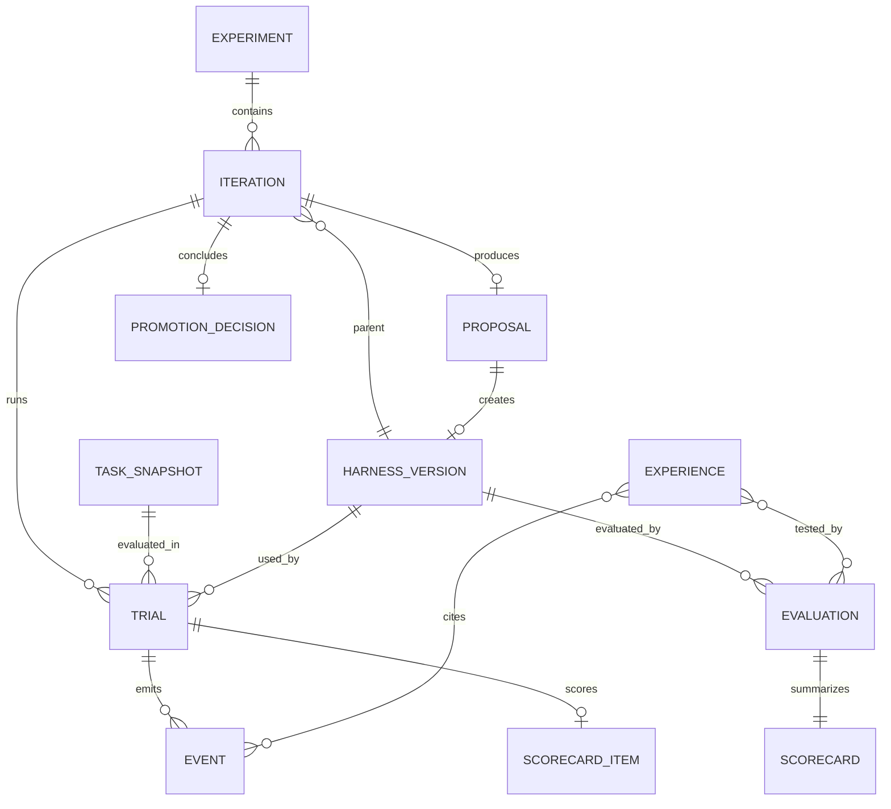

# 12 存储模型与接口

## 12.1 存储分工

- Git 保存 harness 源码与可审查差异。
- 关系数据库保存实体、状态、索引和唯一约束。
- 内容寻址产物库保存大文本、二进制、补丁与报告。
- JSONL 作为每个 trial 的便携原始事件副本。

不要把大型轨迹直接塞进版本表，也不要只靠目录名表达状态。

## 12.2 推荐目录

```text
agent-evolution/
├── pyproject.toml
├── configs/
│   ├── experiment.example.yaml
│   └── promotion-v1.yaml
├── src/evo/
│   ├── control/
│   ├── runtime/
│   ├── teacher/
│   ├── evolution/
│   ├── evaluation/
│   ├── memory/
│   ├── storage/
│   ├── security/
│   └── adapters/
├── harness/
│   ├── harness.yaml
│   ├── system.md
│   ├── bootstrap.py
│   ├── observation.py
│   ├── context.py
│   └── completion.py
├── tests/
│   ├── contract/
│   ├── integration/
│   └── fixtures/
├── migrations/
└── var/
    ├── metadata.db
    ├── artifacts/
    ├── traces/
    ├── bare-repos/
    └── worktrees/
```

生产部署把 `var/` 替换为 PostgreSQL、对象存储和 worker 临时盘。

## 12.3 核心实体



## 12.4 表结构摘要

| 表 | 关键字段 |
|---|---|
| `experiments` | id、config_hash、status、champion_version_id、budget |
| `iterations` | id、experiment_id、seq、plan_hash、state、parent_version_id |
| `harness_versions` | id、parent_id、commit_sha、manifest_hash、status |
| `task_snapshots` | id、task_id、family、content_hash、benchmark_version |
| `trials` | id、logical_key、attempt、state、spec_hash、outcome_ref |
| `events` | trial_id、seq、type、payload_json、artifact_refs |
| `proposals` | id、base_version_id、schema_version、payload、status |
| `evaluations` | id、version_id、dataset_snapshot、config_hash、state |
| `scorecards` | evaluation_id、primary_json、cost_json、constraints_json |
| `promotion_decisions` | id、iteration_id、decision、rule_version、input_hashes |
| `experiences` | id、scope、hypothesis、status、supersedes |
| `artifacts` | digest、size、mime、sensitivity、storage_key |
| `audit_log` | actor、action、target、timestamp、details |

## 12.5 标识符与哈希

- 业务实体使用不可猜测 ID，例如 UUIDv7。
- 代码身份使用完整 Git commit SHA。
- 配置和 JSON 对象先规范化再计算 SHA-256。
- 产物引用使用内容 SHA-256。
- 用户展示版本号 `H_004` 只是实验内别名，不能作为全局主键。

## 12.6 内部接口

```python
class TrialService(Protocol):
    async def submit(self, spec: TrialSpec) -> TrialHandle: ...
    async def wait(self, handle: TrialHandle) -> TrialOutcome: ...
    async def cancel(self, trial_id: str) -> None: ...

class TeacherService(Protocol):
    async def diagnose(self, bundle: EvidenceBundle) -> DiagnosisProposal: ...

class EvolutionService(Protocol):
    async def generate(self, request: EvolutionRequest) -> CandidateResult: ...

class EvaluationService(Protocol):
    async def evaluate(self, request: EvaluationRequest) -> Scorecard: ...

class PromotionService(Protocol):
    def decide(self, request: PromotionRequest) -> PromotionDecision: ...
```

所有请求带 schema version、correlation ID 和配置哈希。

## 12.7 Benchmark Adapter

```python
class BenchmarkAdapter(Protocol):
    def materialize(self, task: TaskSnapshot, target: Path) -> WorkspaceInfo: ...
    def collect_submission(self, workspace: Path) -> SubmissionArtifact: ...
    def score(self, task: TaskSnapshot, submission: SubmissionArtifact) -> TaskScore: ...
    def classify_failure(self, score: TaskScore) -> list[str]: ...
```

`score` 在独立评分沙箱执行。Adapter 返回统一 `TaskScore`，同时保存 benchmark 原生报告。

## 12.8 模型网关

模型网关统一：

- 请求、响应和工具调用格式；
- token、缓存和费用计量；
- 限流、重试和超时；
- 模型配置不可变 ID；
- 供应商 request ID 审计；
- 可用内容与敏感字段过滤。

Harness 不直接调用供应商 SDK，防止候选绕过日志和预算层。

## 12.9 配置版本化

实验配置包含：

```text
student model config
teacher model config
edit model config
H_edit version
benchmark snapshots
budgets
sandbox images and policies
candidate change limits
promotion rule version
prompt/schema versions
```

任何字段变化都生成新配置哈希。跨配置结果可以展示，但默认不能直接参与 Pareto 支配或晋升比较。

## 12.10 数据迁移

Pydantic 模型与数据库 migration 分开版本化：

- 写入只使用当前 schema；
- 读取旧事件通过 upcaster 转为当前内存模型；
- 原始 payload 永不原地重写；
- migration 先在复制数据库和样本产物上验证；
- 关键 scorecard 和 promotion decision 保存规范化快照，避免业务代码更新后无法复盘。
